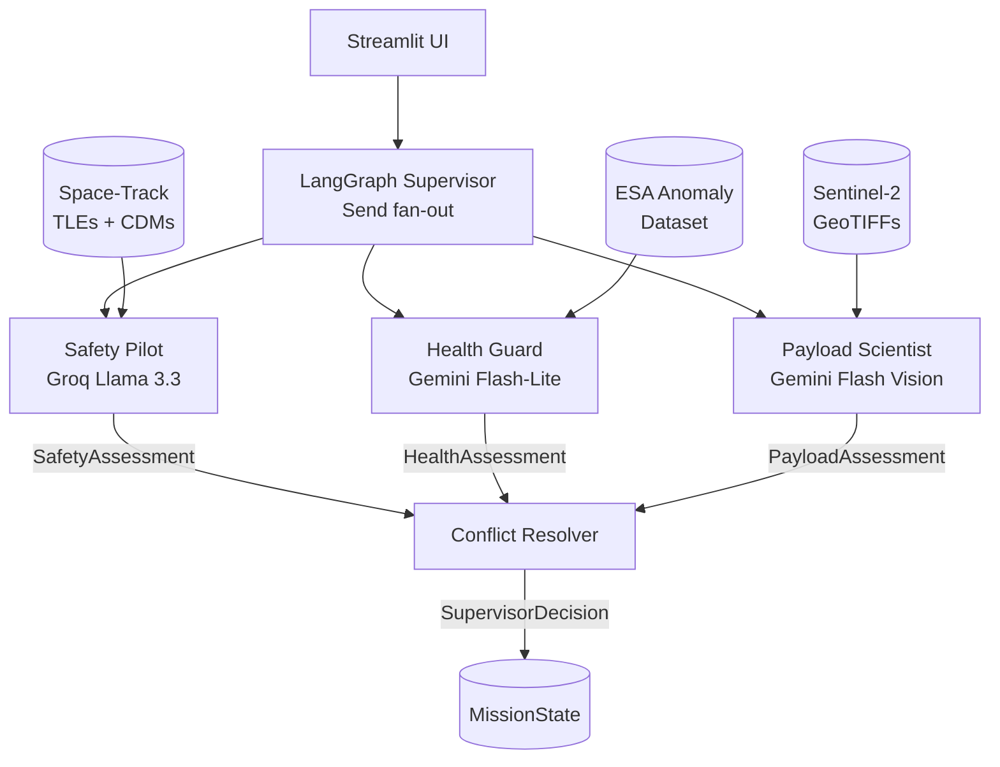

# AMOA — Autonomous Mission Operations Agent

> A multi-agent LLM system that coordinates satellite mission operations — collision avoidance, hardware health monitoring, and payload imagery analysis — under a LangGraph supervisor with a hybrid rule+LLM conflict resolver.

**Not flight software.** Portfolio project demonstrating agent-system harness engineering against real public data.

---

## What It Does

Each mission tick, AMOA fans out three specialized agents in parallel, collects their structured assessments, and resolves any conflicts into a single `SupervisorDecision`:

| Agent | Model | Responsibility | Data Source |
|---|---|---|---|
| **Safety Pilot** | Groq Llama 3.3 70B | Collision probability + time-to-closest-approach from CDMs | NASA Space-Track (TLEs + CDMs) |
| **Health Guard** | Gemini 2.5 Flash-Lite | Telemetry anomaly detection across 1000-row windows | ESA Anomaly Dataset (Mission 1) |
| **Payload Scientist** | Gemini 2.5 Flash Vision | Sentinel-2 GeoTIFF scene analysis | Copernicus / Sentinel-2 |

The **Conflict Resolver** applies a strict rule hierarchy before touching the LLM — hard rules handle safety-critical cases at zero latency, zero cost:

1. `Safety HIGH` → `MANEUVER` (confidence 1.0, no exceptions)
2. `Health CRITICAL` → `SAFE_MODE` (confidence 1.0)
3. Both in failure log → `GROUND_CONTACT`
4. Ambiguous → Groq Llama 3.3 reasons over all three assessments

---

## System Architecture



All LLM calls go through a single `structured_completion` function in `src/amoa/llm.py`. Agents never import provider SDKs directly — the harness handles retry-with-correction, failure categorization, and LangSmith tracing.

---

## Project Structure

```
src/amoa/
├── agents/
│   ├── safety_pilot.py       # Collision avoidance — RiskLevel + RecommendedAction
│   ├── health_guard.py       # Telemetry anomaly detection — AnomalySeverity
│   ├── payload_scientist.py  # Sentinel-2 scene analysis — PayloadAssessment
│   └── supervisor.py         # Conflict resolver — SupervisorDecision
├── data/
│   ├── cdm.py                # CDM parsing + schema
│   ├── esa_loader.py         # Windowed ESA telemetry loader (RAM-safe)
│   ├── sentinel_loader.py    # GeoTIFF → base64 for vision model
│   └── spacetrack_client.py  # Space-Track API with diskcache wrapper
├── baselines/
│   └── isolation_forest.py   # IsolationForest baseline + paired bootstrap CI
├── eval/
│   ├── harness.py            # make eval → RESULTS.md
│   └── metrics.py            # F1, precision, recall
├── ui/
│   └── streamlit_app.py      # Four-panel dashboard, scenario dropdown
├── graph.py                  # LangGraph graph definition + Send fan-out
├── llm.py                    # Provider abstraction (Groq / Gemini / Gemini Vision)
├── state.py                  # MissionState — Pydantic v2 shared graph state
└── config.py                 # Pydantic Settings — loads from .env
```

---

## MissionState Schema

`MissionState` is a Pydantic v2 model that accumulates outputs across the graph:

| Field | Type | Description |
|---|---|---|
| `scenario` | `str` | Active scenario key (`high_risk`, `conflict`, `degraded`) |
| `safety_assessment` | `SafetyAssessment \| None` | Safety Pilot output |
| `health_assessment` | `HealthAssessment \| None` | Health Guard output |
| `payload_assessment` | `PayloadAssessment \| None` | Payload Scientist output |
| `supervisor_decision` | `SupervisorDecision \| None` | Conflict Resolver final action |
| `failure_log` | `list[FailureEvent]` | Append-only structured failure records |

---

## Prerequisites

- Python 3.11+
- [`uv`](https://docs.astral.sh/uv/) — package manager (`pip install uv`)
- API keys (see below)

### Required API Keys

| Key | Where to get it | Used by |
|---|---|---|
| `GOOGLE_API_KEY` | [Google AI Studio](https://aistudio.google.com/app/apikey) | Health Guard + Payload Scientist |
| `GROQ_API_KEY` | [Groq Console](https://console.groq.com/keys) | Safety Pilot + Conflict Resolver |
| `SPACETRACK_USERNAME` / `SPACETRACK_PASSWORD` | [space-track.org](https://www.space-track.org/auth/createAccount) (free account) | Safety Pilot |
| `COPERNICUS_USERNAME` / `COPERNICUS_PASSWORD` | [Copernicus Data Space](https://dataspace.copernicus.eu/) (free account) | Payload Scientist |
| `LANGSMITH_API_KEY` | [smith.langchain.com](https://smith.langchain.com/) (optional — disables tracing if absent) | Observability |

---

## Setup

```bash
# 1. Clone
git clone https://github.com/kaushik701/Autonomous-Mission-Operations-Agent-AMOA.git
cd Autonomous-Mission-Operations-Agent-AMOA

# 2. Install dependencies
uv sync

# 3. Configure environment
cp .env.example .env
# Open .env and fill in your API keys

# 4. Verify setup (smoke test — hits live APIs)
uv run pytest tests/test_smoke.py -v
```

---

## Running

```bash
# Launch Streamlit dashboard (recommended)
make dev
# → http://localhost:8501

# Run one mission tick in the terminal
make demo

# Run full eval harness → writes RESULTS.md
make eval

# Run all tests
make test

# Lint + format
make lint
make format
```

### Streamlit Dashboard

The UI exposes four panels:

- **Scenario selector** — choose `high_risk`, `conflict`, or `degraded`
- **Safety Pilot** — CDM details + risk level + recommended action
- **Health Guard** — telemetry summary + anomaly severity
- **Payload Scientist** — Sentinel-2 scene thumbnail + observation score
- **Supervisor Decision** — final action, confidence, degraded-mode flag, and reasoning

---

## Evaluation

`make eval` runs the full harness:

- Health Guard vs. IsolationForest baseline on ESA Anomaly Dataset (window-level F1)
- Paired bootstrap 95% CIs to determine statistical significance
- Results written to `RESULTS.md`

Failures are appended to `src/amoa/eval/failures.jsonl` for offline analysis.

---

## Testing

```bash
uv run pytest -v
```

- `test_smoke.py` — verifies config loads and API keys are present
- `test_safety_pilot.py` — three CDM scenarios (LOW / MEDIUM / HIGH)
- `test_scenarios.py` — graph integration tests for all three scenario fixtures
- `test_snapshots.py` — syrupy snapshot tests lock expected agent output shapes
- `test_llm.py` — provider abstraction unit tests (mocked)

Snapshot baselines are committed. If a prompt change alters output shape, the snapshot diff is the signal — update only if intentional.

---

## Key Design Decisions

| Decision | Choice | Reason |
|---|---|---|
| Orchestration | LangGraph `Send` fan-out | Parallel agent dispatch with typed state |
| LLM abstraction | Single `structured_completion` in `llm.py` | Swap providers without touching agent code |
| Provider | Groq (Safety, Resolver) + Gemini (Health, Payload) | Free-tier limits + model capability fit |
| Conflict resolution | Rule hierarchy → LLM fallback | Zero latency/cost for safety-critical cases |
| Data loading | Windowed ESA loader, Pillow for GeoTIFFs | 6 GB RAM constraint on dev machine |
| Caching | `diskcache` on Space-Track client | 30 req/min rate limit — avoids redundant calls |
| Failure logging | `failures.jsonl` + LangSmith | Structured offline analysis + live tracing |

Full ADRs in `docs/decisions/`.

---

## Limitations

- **Not flight software** — digital twin only, no real satellite command uplink
- **Local execution** — no cloud deployment; Streamlit runs at `localhost:8501`
- **Free-tier quotas** — Gemini RPM caps are tight; cache aggressively in dev
- **ESA dataset** — Mission 1 only, time-windowed subset (full dataset is 12 GB)
- **Space-Track CDMs** — mocked in tests; live pull requires approved CDM tier

---

## Tech Stack

`Python 3.11` · `uv` · `LangGraph` · `Pydantic v2` · `httpx` · `anthropic` · `google-generativeai` · `groq` · `scikit-learn` · `scipy` · `Streamlit` · `SQLModel` · `diskcache` · `syrupy` · `ruff` · `pytest`

---

## License

MIT
