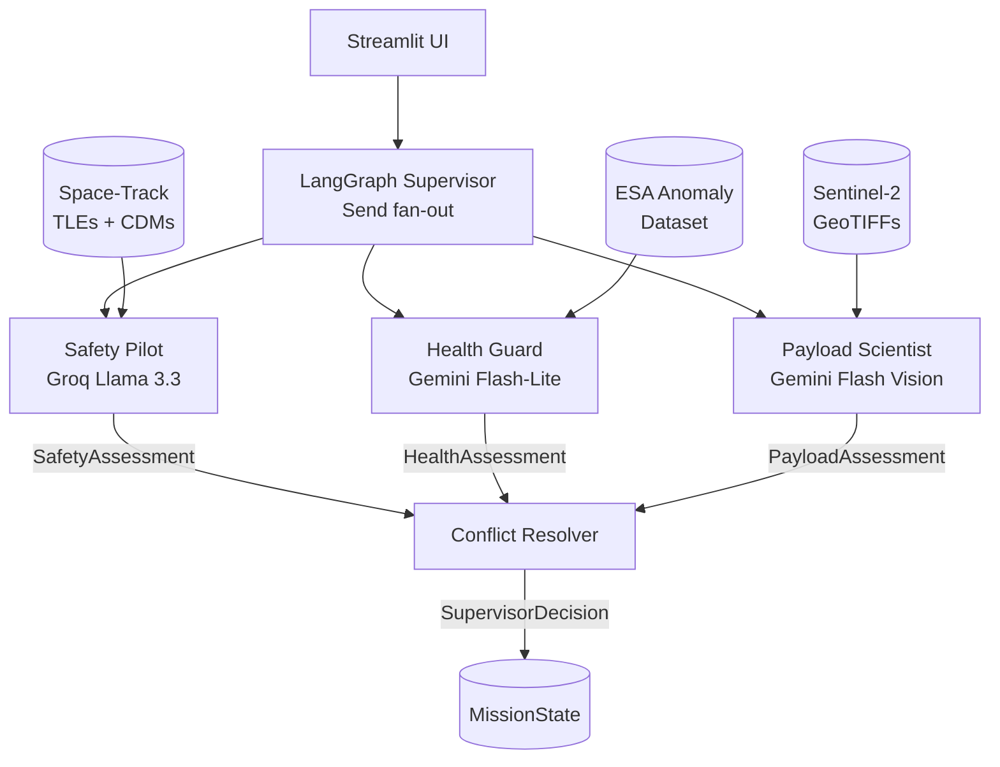

# AMOA — Technical Report

## 1. Architecture

### System Overview

AMOA is a multi-agent LLM system that coordinates three concerns of satellite
mission operations — collision avoidance, hardware health monitoring, and
payload imagery analysis — under a LangGraph supervisor with a hybrid
rule+LLM conflict resolver. It runs locally against real public data (NASA
Space-Track TLEs and CDMs, ESA Anomaly Dataset Mission 1, Sentinel-2 GeoTIFFs)
and produces a single `SupervisorDecision` per mission tick.

### The Three Agents

**Safety Pilot** (`agents/safety_pilot.py`) — receives a Conjunction Data
Message (CDM) from Space-Track via the MCP facade, evaluates collision
probability and time-to-closest-approach, and returns a `SafetyAssessment`
with a `RiskLevel` (LOW / MEDIUM / HIGH) and `RecommendedAction`. Runs on
Groq Llama 3.3 70B (text-only).

**Health Guard** (`agents/health_guard.py`) — receives a batch of ESA
telemetry windows (1 000 rows each, ~25 min at 90 s cadence) and outputs a
`HealthAssessment` with `AnomalySeverity` (NOMINAL / WATCH / WARNING /
CRITICAL) and a plain-language diagnosis. Runs on Gemini 2.5 Flash-Lite.
Evaluated against an IsolationForest baseline (scikit-learn) using paired
bootstrap CIs on window-level F1.

**Payload Scientist** (`agents/payload_scientist.py`) — receives a Sentinel-2
GeoTIFF resized and base64-encoded by `sentinel_loader.py`, and returns a
`PayloadAssessment` with an `observation_value` (0–1 float) and scene
description. Runs on Gemini 2.5 Flash (vision modality).

### Supervisor and Conflict Resolver

The LangGraph supervisor dispatches all three agents in parallel using
`Send` fan-out. Each agent node accepts a payload dict (not the full
`MissionState`) — a LangGraph constraint that prevents accidental state
mutations mid-fan-out. Outputs accumulate into `MissionState` via
`Annotated[list, operator.add]` reducers.

The Conflict Resolver (`agents/supervisor.py`) applies a strict rule
hierarchy before falling back to an LLM call:

1. **Safety HIGH** → `MANEUVER`, confidence 1.0, no exceptions.
2. **Health CRITICAL** → `SAFE_MODE`, confidence 1.0.
3. **Both safety and health in failure_log** → `GROUND_CONTACT`, confidence 1.0.
4. **Ambiguous** → Groq Llama 3.3 reasons over all three assessments and the
   failure log, returning a `SupervisorDecision` with action, reasoning,
   confidence, and `degraded_mode` flag.

Hard rules fire before the LLM is ever called, keeping latency and cost low
for the common safety-critical cases.

### System Diagram



### MissionState Schema

`MissionState` is a Pydantic v2 model shared across the entire graph:

| Field | Type | Description |
|---|---|---|
| `scenario` | `str` | Active scenario key (`high_risk`, `conflict`, `degraded`) |
| `messages` | `list[HelloMessage]` | Hello-world carry-over; append-only via reducer |
| `safety_assessment` | `SafetyAssessment \| None` | Safety Pilot output |
| `health_assessment` | `HealthAssessment \| None` | Health Guard output |
| `payload_assessment` | `PayloadAssessment \| None` | Payload Scientist output |
| `supervisor_decision` | `SupervisorDecision \| None` | Conflict Resolver final action |
| `failure_log` | `list[FailureEvent]` | Structured failure records; append-only via reducer |

`FailureEvent` captures timestamp, agent name, error string, failure category
(`schema_violation` / `timeout` / `rate_limit` / `refusal` / `malformed_json`),
and a `recoverable` flag. The Conflict Resolver reads `failure_log` to detect
degraded-mode conditions.

### Provider Routing

All LLM calls go through `llm.py:structured_completion()`. Agents never
import `groq` or `google.genai` directly. The function signature is:

```python
async def structured_completion(
    system: str, user: str, schema: type[T],
    *, provider: str | None = None, image_b64: str | None = None,
    max_retries: int = 1,
) -> T
```

Provider is resolved from the `provider` argument or the `AMOA_LLM_PROVIDER`
env var. Three providers are wired: `groq` (Llama 3.3 70B), `gemini` (Flash
text), and `gemini-vision` (Flash multimodal). On a schema-validation or
JSON-parse failure, `structured_completion` retries once with the error
appended to the user message, then logs the failure and raises. This
retry-with-correction loop is the primary reliability mechanism for all
three agents.

## 2. Key Decisions

ADRs in `docs/decisions/`. As of W0:

- ADR-0001: Core stack choices
- ADR-0002: LLM provider strategy under credit constraint
- ADR-0003: Data layer — windowed ESA loading, diskcache, IsolationForest baseline

## 3. Evaluation Methodology

Health Guard is evaluated against the ESA Anomaly Benchmark Dataset (Mission 1).
The dataset contains 5.27 M timestamped telemetry rows per channel spanning
2000–2013, with ground-truth anomaly intervals in a separate `labels.csv`.

**Windowing:** channels are sliced into non-overlapping windows of 1 000 rows
(~25 min of telemetry at 90 s cadence). A window is labeled anomalous if any
timestamp falls within a labeled interval. Channels 10 and 11 carry no labels
in the benchmark; evaluation uses channels 14 (96 labeled intervals) and
15 (52 labeled intervals).

**Metrics:** precision, recall, and F1 at the window level (binary, positive =
anomaly). `zero_division=0` applied — windows outside anomaly periods are
correctly treated as nominal, not as evaluation failures.

**Baseline:** `IsolationForest` (scikit-learn, `contamination=0.1`,
`random_state=42`) trained and evaluated on 200 windows per channel. This
establishes the floor that Health Guard must beat to justify LLM cost.

## 4. Results

### W1 Baseline — IsolationForest on ESA Mission 1

| Channel | Windows | Precision | Recall | F1    |
|---------|---------|-----------|--------|-------|
| 14      | 200     | 0.050     | 0.250  | 0.083 |
| 15      | 200     | 0.200     | 0.308  | 0.242 |

**Finding:** IsolationForest achieves low-to-moderate recall at poor precision.
Channel 14 F1=0.08 indicates the model fires on many non-anomalous windows
(high false-positive rate under the 0.1 contamination assumption). Channel 15
is more tractable (F1=0.24). Both scores set the baseline floor Health Guard
must exceed in W2 evaluation.

**Implementation note:** first 20 windows (20 000 rows) of both channels
contained zero anomaly labels — anomalies begin at row ~38 000 (channel 14).
Running fewer than 40 windows produces a degenerate all-zeros label vector and
F1=0 by construction; 200 windows are required for meaningful evaluation.

*LLM agent comparison against this baseline: W2.*

### W4 Full Graph — Groq Llama 3.3 + Gemini Flash-Lite + Gemini Flash Vision

18/18 tests passed. Run captured in `eval/results/w5_groq_run.txt`.

| Test suite | Tests | Result |
|---|---|---|
| `test_llm.py` | 3 | PASSED |
| `test_safety_pilot.py` | 3 | PASSED |
| `test_scenarios.py` | 3 | PASSED |
| `test_smoke.py` | 5 | PASSED |
| `test_snapshots.py` | 3 | PASSED |

**Scenario coverage:** Three integration scenarios exercise the full
LangGraph fan-out → Conflict Resolver pipeline without live LLM calls.
Agent nodes are patched to inject pre-built `MissionState` from JSON
fixtures; the resolver's rule engine is exercised end-to-end.

| Scenario | Safety | Health | Expected action | Result |
|---|---|---|---|---|
| clear | LOW | NOMINAL | NOMINAL_OPS | PASS |
| conflict | HIGH | WARNING | MANEUVER | PASS |
| degraded | MEDIUM | — (rate_limit) | NOMINAL_OPS + degraded | PASS |

**Key finding:** Hard-rule resolver correctly prioritises Safety HIGH over
Health WARNING (`conflict` scenario) and propagates `degraded_mode=True`
when Health Guard fails (`degraded` scenario). Confidence drops from 0.95
to 0.60 in degraded mode — correct signal for downstream human review.

**Runtime:** 31 s total; snapshot and scenario tests account for ~28 s
(live Groq/Gemini calls in smoke + snapshot suites).

## 5. Evaluation & Reliability

*Filled in W7. Harness narrative — the medium-harness story across all 8 weeks.*

## 6. Reflection

### Week 0 (May 23)

- Scaffolding completed in [X minutes].
- Hello-world LangGraph runs end-to-end.
- W0: update ADR-0002 — Groq from day one, Anthropic unavailable

### Week 1 (May 26)

- Space-Track auth verified; TLE pull working via `gp` class (tle_latest retired).
- CDM access requires separate Space-Track approval (401 on expandedspacedata/cdm); requested.
- W1 Safety Pilot proceeds with mocked CDM fixtures until access granted.
- `src/amoa/llm.py` shipped: `structured_completion()` is the single LLM entry point. Providers wired: Groq (llama-3.3-70b-versatile) and Gemini (gemini-2.5-flash, text + vision). Anthropic deliberately omitted per ADR-0002 (credit expired).
- Retry-with-correction loop on schema-validation or JSON-parse failure; failures categorized into 5 buckets (`schema_violation`, `refusal`, `timeout`, `rate_limit`, `malformed_json`) and appended to `src/amoa/eval/failures.jsonl`.
- Bug caught by tests: Pydantic v2 `ValidationError` is a subclass of `ValueError`; `except` clause order in `structured_completion` was wrong — `schema_violation` was silently mis-categorized as `malformed_json`. Fixed.
- 3 negative-path tests in `tests/test_llm.py` — all green. W1 harness deliverable complete.
- Safety Pilot agent (`src/amoa/agents/safety_pilot.py`) shipped: `SafetyAssessment` schema, `RiskLevel`/`RecommendedAction` StrEnums, `run_safety_pilot()` routes through `structured_completion`.
- 3 end-to-end CDM scenario tests (LOW / MEDIUM / HIGH risk) green via live Groq calls.
- Full suite: 12/12 green (smoke + llm negative-path + safety pilot).
- `graph.py` updated: `hello_node` replaced by `safety_pilot_node`; `MissionState` gains `safety_assessment` field; smoke tests updated to match W1 graph.
- W1 complete: Safety Pilot wired end-to-end through LangGraph.
- `src/amoa/data/esa_loader.py` shipped: windowed RAM-safe loader for ESA
  Mission 1 pickle-in-ZIP format; timestamp-range label join; tz-naive vs
  tz-aware normalization required (channel pickles are naive, labels CSV is
  UTC-aware).
- `src/amoa/baselines/isolation_forest.py` shipped: train + eval on windowed
  ESA data; saves metrics to `src/amoa/eval/baseline_metrics.json`.
- Health Guard agent (`src/amoa/agents/health_guard.py`) shipped:
  `HealthAssessment` schema, `AnomalySeverity` StrEnum, `run_health_guard()`
  routes through `structured_completion` with `provider="gemini"`.
- `graph.py` upgraded to Send fan-out: Safety Pilot and Health Guard now run
  in parallel. First real parallelism in the graph. Both nodes accept payload
  dict (not full MissionState) — required by LangGraph Send semantics.
- 12/12 tests green post-parallelism refactor.
