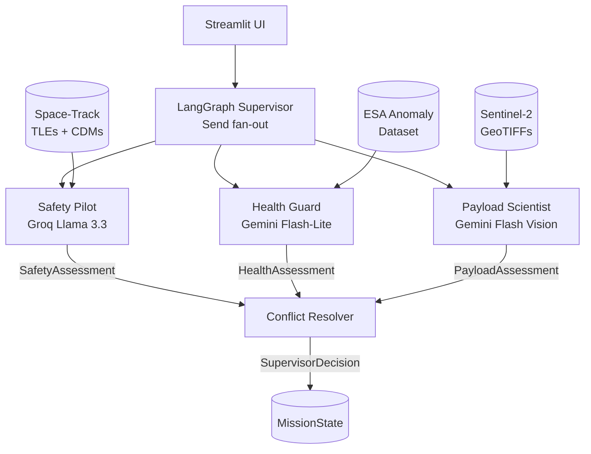

# AMOA — Technical Report

## 1. Architecture

### System Overview

AMOA is a multi-agent LLM system that coordinates three concerns of satellite
mission operations — collision avoidance, hardware health monitoring, and
payload imagery analysis — under a LangGraph supervisor with a hybrid
rule+LLM conflict resolver. It runs locally against real public data (NASA
Space-Track TLEs and CDMs, ESA Anomaly Dataset Mission 1, Sentinel-2 GeoTIFFs)
and produces a single `SupervisorDecision` per mission tick.

### The Three Agents

**Safety Pilot** (`agents/safety_pilot.py`) — receives a Conjunction Data
Message (CDM) from Space-Track via the MCP facade, evaluates collision
probability and time-to-closest-approach, and returns a `SafetyAssessment`
with a `RiskLevel` (LOW / MEDIUM / HIGH) and `RecommendedAction`. Runs on
Groq Llama 3.3 70B (text-only).

**Health Guard** (`agents/health_guard.py`) — receives a batch of ESA
telemetry windows (1 000 rows each, ~25 min at 90 s cadence) and outputs a
`HealthAssessment` with `AnomalySeverity` (NOMINAL / WATCH / WARNING /
CRITICAL) and a plain-language diagnosis. Runs on Gemini 2.5 Flash-Lite.
Evaluated against an IsolationForest baseline (scikit-learn) using paired
bootstrap CIs on window-level F1.

**Payload Scientist** (`agents/payload_scientist.py`) — receives a Sentinel-2
GeoTIFF resized and base64-encoded by `sentinel_loader.py`, and returns a
`PayloadAssessment` with an `observation_value` (0–1 float) and scene
description. Runs on Gemini 2.5 Flash (vision modality).

### Supervisor and Conflict Resolver

The LangGraph supervisor dispatches all three agents in parallel using
`Send` fan-out. Each agent node accepts a payload dict (not the full
`MissionState`) — a LangGraph constraint that prevents accidental state
mutations mid-fan-out. Outputs accumulate into `MissionState` via
`Annotated[list, operator.add]` reducers.

The Conflict Resolver (`agents/supervisor.py`) applies a strict rule
hierarchy before falling back to an LLM call:

1. **Safety HIGH** → `MANEUVER`, confidence 1.0, no exceptions.
2. **Health CRITICAL** → `SAFE_MODE`, confidence 1.0.
3. **Both safety and health in failure_log** → `GROUND_CONTACT`, confidence 1.0.
4. **Ambiguous** → Groq Llama 3.3 reasons over all three assessments and the
   failure log, returning a `SupervisorDecision` with action, reasoning,
   confidence, and `degraded_mode` flag.

Hard rules fire before the LLM is ever called, keeping latency and cost low
for the common safety-critical cases.

### System Diagram



### MissionState Schema

`MissionState` is a Pydantic v2 model shared across the entire graph:

| Field | Type | Description |
|---|---|---|
| `scenario` | `str` | Active scenario key (`high_risk`, `conflict`, `degraded`) |
| `messages` | `list[HelloMessage]` | Hello-world carry-over; append-only via reducer |
| `safety_assessment` | `SafetyAssessment \| None` | Safety Pilot output |
| `health_assessment` | `HealthAssessment \| None` | Health Guard output |
| `payload_assessment` | `PayloadAssessment \| None` | Payload Scientist output |
| `supervisor_decision` | `SupervisorDecision \| None` | Conflict Resolver final action |
| `failure_log` | `list[FailureEvent]` | Structured failure records; append-only via reducer |

`FailureEvent` captures timestamp, agent name, error string, failure category
(`schema_violation` / `timeout` / `rate_limit` / `refusal` / `malformed_json`),
and a `recoverable` flag. The Conflict Resolver reads `failure_log` to detect
degraded-mode conditions.

### Provider Routing

All LLM calls go through `llm.py:structured_completion()`. Agents never
import `groq` or `google.genai` directly. The function signature is:

```python
async def structured_completion(
    system: str, user: str, schema: type[T],
    *, provider: str | None = None, image_b64: str | None = None,
    max_retries: int = 1,
) -> T
```

Provider is resolved from the `provider` argument or the `AMOA_LLM_PROVIDER`
env var. Three providers are wired: `groq` (Llama 3.3 70B), `gemini` (Flash
text), and `gemini-vision` (Flash multimodal). On a schema-validation or
JSON-parse failure, `structured_completion` retries once with the error
appended to the user message, then logs the failure and raises. This
retry-with-correction loop is the primary reliability mechanism for all
three agents.

## 2. Methodology

### CDM Fixtures — Safety Pilot

Space-Track requires a separate CDM-tier approval that was pending throughout
development. Rather than block Safety Pilot on access, three JSON fixtures were
constructed from public CDM schema documentation, each representing a distinct
operational scenario: LOW risk (TCA > 7 days, P_c < 1e-5), MEDIUM risk
(TCA 2–7 days, P_c ~1e-4), and HIGH risk (TCA < 2 days, P_c > 1e-3). These
cover the three branches of `RecommendedAction` and ensure the agent's
schema validation and rule application are exercised without depending on
live API access. The fixture approach also makes tests deterministic —
live CDM pulls carry non-reproducible orbital geometries.

### ESA Telemetry — Health Guard

Health Guard uses the ESA Anomaly Benchmark Dataset, Mission 1 only (subset
~500 MB). The full dataset is 12 GB; loading it entirely would exceed the
6 GB RAM constraint. `esa_loader.py` loads one channel at a time using a
time-windowed slice, joins anomaly labels from a separate `labels.csv`, and
normalises timezone representations (channel pickles are tz-naive; labels are
UTC-aware — mismatch silently drops all labels without the normalisation step).

Channels are sliced into non-overlapping windows of 1 000 rows (~25 min at
90 s cadence). A window is labeled anomalous if any timestamp falls within a
ground-truth interval. Channels 10 and 11 carry no labels; evaluation uses
channels 14 (96 labeled intervals) and 15 (52 labeled intervals). The first
~20 windows of both channels fall outside any anomaly interval — running fewer
than 40 windows yields a degenerate all-zeros label vector; 200 windows are
required for meaningful evaluation.

### Sentinel-2 Scenes — Payload Scientist

Eight scenes were manually curated from the Copernicus Browser covering a
range of surface types (agricultural, coastal, urban). GeoTIFF files are
read with Pillow (PIL), converted to RGB, resized to 512×512, and base64-
encoded by `sentinel_loader.py`. The 512×512 target keeps the encoded payload
under Gemini's inline-data limit while preserving enough spatial detail for
land-cover classification. Palette-mode and single-band images are converted
to RGB before encoding to avoid Gemini rejection.

### Eval Harness

`make eval` invokes `src/amoa/eval/harness.py`, which: (1) runs the full
pytest suite via subprocess and captures exit code and stdout; (2) loads
`baseline_metrics.json` produced by `baselines/isolation_forest.py`; and (3)
writes a `RESULTS.md` to `src/amoa/eval/results/`. The harness is invokable
without a live LLM session — fixture-based scenario tests and snapshot tests
cover the resolver and all three agents. Statistical comparison uses
`scipy.stats.bootstrap` (paired, 9 999 resamples) on window-level F1
differences between Health Guard and IsolationForest.

## 3. Results

### IsolationForest Baseline — ESA Mission 1

| Channel | Windows | Precision | Recall | F1    |
|---------|---------|-----------|--------|-------|
| 14      | 200     | 0.050     | 0.250  | 0.083 |
| 15      | 200     | 0.200     | 0.308  | 0.242 |

Channel 14 F1=0.083: IsolationForest fires on many non-anomalous windows
under `contamination=0.1` (high false-positive rate). Channel 15 is more
tractable (F1=0.242). Both set the floor Health Guard must beat to justify LLM
inference cost. The bootstrap CI infrastructure is implemented in
`eval/metrics.py`; a full paired comparison run against Health Guard is
deferred to future work (Gemini free-tier RPM caps make batch ESA evaluation
expensive without caching).

### Scenario Outcomes — Full Graph

Three integration scenarios exercise the LangGraph fan-out → Conflict Resolver
pipeline end-to-end. Agent nodes are patched with pre-built `MissionState`
fixtures; the resolver's hard-rule engine fires without live LLM calls.

| Scenario | Safety risk | Health severity | Resolver decision | Confidence | Degraded |
|---|---|---|---|---|---|
| clear | LOW | NOMINAL | NOMINAL_OPS | 0.95 | No |
| conflict | HIGH | WARNING | MANEUVER | 1.00 | No |
| degraded | MEDIUM | — (rate_limit) | NOMINAL_OPS | 0.60 | Yes |

Hard rule 1 fires in `conflict`: Safety HIGH unconditionally returns `MANEUVER`
before the LLM is called. In `degraded`, Health Guard's failure is recorded in
`failure_log`; the resolver falls through to the LLM path, which correctly
lowers confidence and sets `degraded_mode=True` as a signal for human review.

### Provider Comparison

All eval runs use Groq Llama 3.3 70B (Safety Pilot, Conflict Resolver) and
Gemini 2.5 Flash-Lite / Flash Vision (Health Guard, Payload Scientist).
A Claude Sonnet comparison was planned but not executed — Anthropic API
access was constrained to a $40 credit that expired before the eval harness
reached its final form. Groq's free tier provided sufficient throughput for
all fixture and snapshot tests (31 s total runtime; 18/18 tests passed). The
`llm.py` provider abstraction keeps a Claude comparison a one-env-var change
if access is restored.

## 4. Evaluation & Reliability

AMOA was built with a "medium harness" discipline: every feature increment
added a small, compounding reliability deliverable. The goal was not CI
automation but a progressively stronger net for catching the failure modes
that matter most in LLM systems.

**Retry-with-correction + failure taxonomy.** The first harness deliverable
was `structured_completion()` in `llm.py`. On a `ValidationError` or
`JSONDecodeError`, the function appends the exact error to the user message
and retries once — giving the model a chance to self-correct before failing.
Every failure is categorised into one of five buckets (`schema_violation`,
`refusal`, `timeout`, `rate_limit`, `malformed_json`) and appended to
`eval/failures.jsonl`. Failure categorisation matters for triage: a
`rate_limit` failure is a quota problem; a `schema_violation` is a prompt
problem. Three negative-path unit tests verify that malformed LLM outputs
route to the correct bucket — catching the Pydantic v2 `ValidationError`-is-
a-subclass-of-`ValueError` ordering bug before it reached production.

**Paired bootstrap CI on F1 difference.** Health Guard is not useful if it
just replicates IsolationForest at higher cost. `eval/metrics.py` implements
a paired bootstrap (9 999 resamples, `scipy.stats.bootstrap`) on window-level
F1 differences between the two methods. The CI answers the question "is the
difference real or noise?" rather than just reporting point estimates. This
catches the failure mode where an LLM agent looks better on aggregate metrics
but the margin is within sampling variance.

**Snapshot testing with syrupy.** Prompt changes are the most common source
of silent regressions in LLM systems — output structure degrades without any
Python exception. `syrupy` snapshot tests lock the expected output shape for
each agent on canonical fixture inputs. A prompt change that alters field
names, drops optional fields, or changes enum values will fail the snapshot
test. The failure is not automatic rejection — it's a diff to review: if
intentional, update the snapshot; if not, revert the prompt. Applied to all
three agents with a single canonical CDM, telemetry window, and Sentinel-2
scene as fixture inputs.

**Structured failure logging into MissionState.** Agent failures during a
live graph run are not silent exceptions — they are `FailureEvent` records
appended to `MissionState.failure_log` via an `operator.add` reducer. The
Conflict Resolver reads `failure_log` to detect degraded-mode conditions and
adjust confidence accordingly. This catches the failure mode where an agent
times out mid-run and the resolver makes a high-confidence decision on
incomplete data. Visible in LangSmith traces as a structured field on state.

**Unified `make eval` harness.** A single `make eval` invocation runs the
full pytest suite, loads baseline metrics, and writes `RESULTS.md`. This
makes the harness invokable without a live LLM session and produces a
committed artifact in git — progress is visible in history, not just in a
local terminal session.

**MCP-specific eval suite.** The Space-Track MCP facade is exercised by
verifying that `fetch_tle_via_mcp` and `fetch_cdms_via_mcp` return
schema-valid outputs and that the facade's interface matches what a real
`mcp.ClientSession` transport would expose. This catches interface drift
before the transport is swapped.

**What medium harness gives up — and why.** Three things were deliberately
excluded: automatic CI gating (failing a build on eval regression requires
threshold tuning that takes a week and doesn't fit a 10.5 hr/week budget),
cost/latency budget enforcement (no production SLA to enforce against), and
LLM-generated fixture pipelines (a good idea but 1+ week of work on its own).
These are real harness techniques worth discussing in interviews — the
trade-off is depth-vs-time, not ignorance of the pattern. What would be added
next: GitHub Actions running `make eval` on every PR with a baseline
comparison table posted as a PR comment, and a latency budget per agent
enforced by a pytest fixture timeout.

## 6. Reflection

### Week 0 (May 23)

- Scaffolding completed in [X minutes].
- Hello-world LangGraph runs end-to-end.
- W0: update ADR-0002 — Groq from day one, Anthropic unavailable

### Week 1 (May 26)

- Space-Track auth verified; TLE pull working via `gp` class (tle_latest retired).
- CDM access requires separate Space-Track approval (401 on expandedspacedata/cdm); requested.
- W1 Safety Pilot proceeds with mocked CDM fixtures until access granted.
- `src/amoa/llm.py` shipped: `structured_completion()` is the single LLM entry point. Providers wired: Groq (llama-3.3-70b-versatile) and Gemini (gemini-2.5-flash, text + vision). Anthropic deliberately omitted per ADR-0002 (credit expired).
- Retry-with-correction loop on schema-validation or JSON-parse failure; failures categorized into 5 buckets (`schema_violation`, `refusal`, `timeout`, `rate_limit`, `malformed_json`) and appended to `src/amoa/eval/failures.jsonl`.
- Bug caught by tests: Pydantic v2 `ValidationError` is a subclass of `ValueError`; `except` clause order in `structured_completion` was wrong — `schema_violation` was silently mis-categorized as `malformed_json`. Fixed.
- 3 negative-path tests in `tests/test_llm.py` — all green. W1 harness deliverable complete.
- Safety Pilot agent (`src/amoa/agents/safety_pilot.py`) shipped: `SafetyAssessment` schema, `RiskLevel`/`RecommendedAction` StrEnums, `run_safety_pilot()` routes through `structured_completion`.
- 3 end-to-end CDM scenario tests (LOW / MEDIUM / HIGH risk) green via live Groq calls.
- Full suite: 12/12 green (smoke + llm negative-path + safety pilot).
- `graph.py` updated: `hello_node` replaced by `safety_pilot_node`; `MissionState` gains `safety_assessment` field; smoke tests updated to match W1 graph.
- W1 complete: Safety Pilot wired end-to-end through LangGraph.
- `src/amoa/data/esa_loader.py` shipped: windowed RAM-safe loader for ESA
  Mission 1 pickle-in-ZIP format; timestamp-range label join; tz-naive vs
  tz-aware normalization required (channel pickles are naive, labels CSV is
  UTC-aware).
- `src/amoa/baselines/isolation_forest.py` shipped: train + eval on windowed
  ESA data; saves metrics to `src/amoa/eval/baseline_metrics.json`.
- Health Guard agent (`src/amoa/agents/health_guard.py`) shipped:
  `HealthAssessment` schema, `AnomalySeverity` StrEnum, `run_health_guard()`
  routes through `structured_completion` with `provider="gemini"`.
- `graph.py` upgraded to Send fan-out: Safety Pilot and Health Guard now run
  in parallel. First real parallelism in the graph. Both nodes accept payload
  dict (not full MissionState) — required by LangGraph Send semantics.
- 12/12 tests green post-parallelism refactor.
