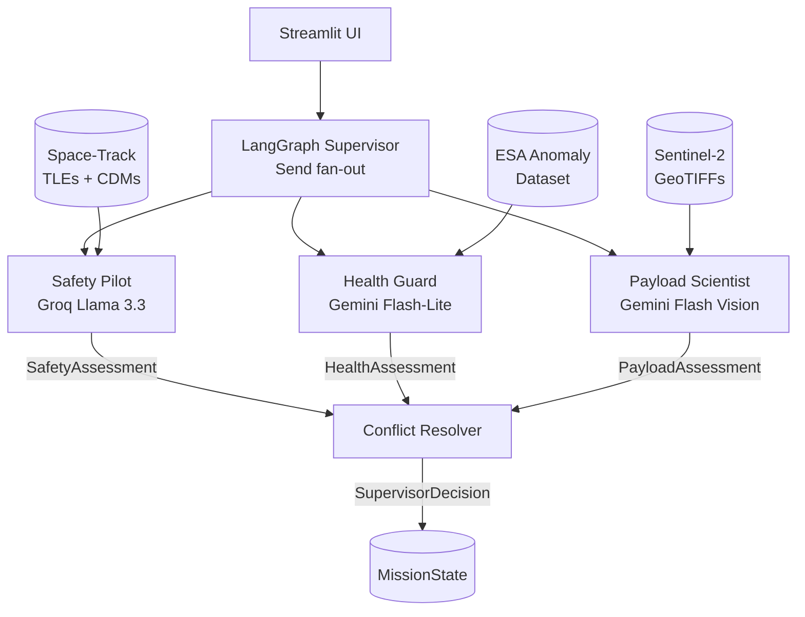

# AMOA — Architecture

## System Diagram

## State Schema

`MissionState` (Pydantic v2) accumulates outputs across the graph.

| Field | Type | Description |
|---|---|---|
| `scenario` | `str` | Active scenario key |
| `messages` | `list[HelloMessage]` | Append-only via reducer |
| `safety_assessment` | `SafetyAssessment \| None` | Safety Pilot output |
| `health_assessment` | `HealthAssessment \| None` | Health Guard output |
| `payload_assessment` | `PayloadAssessment \| None` | Payload Scientist output |
| `supervisor_decision` | `SupervisorDecision \| None` | Conflict Resolver final action |
| `failure_log` | `list[FailureEvent]` | Append-only structured failure records |

## Provider Routing

All LLM calls go through `src/amoa/llm.py:structured_completion`.
Provider selected by `provider` arg or `AMOA_LLM_PROVIDER` env var.
Three providers: `groq`, `gemini`, `gemini-vision`. See ADR-0002.

## Data Sources

- Space-Track (TLEs, CDMs) → Safety Pilot via MCP facade
- ESA Anomaly Dataset, Mission 1 → Health Guard
- Sentinel-2 GeoTIFFs via Copernicus → Payload Scientist

## Observability

LangSmith tracing on every agent call. Project: `amoa`. Failures also
logged to `src/amoa/eval/failures.jsonl` for offline analysis.

## Deployment

Local only. `make demo` boots Streamlit at localhost:8501. Recorded
walkthrough is the shareable artifact.
